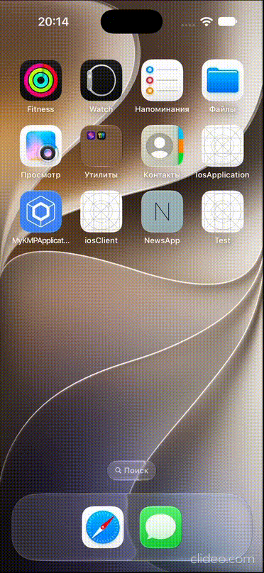

# News App (Kotlin Multiplatform)
News app built with Kotlin Multiplatform, supporting Android and iOS. The app
follows the MVI architecture to ensure clean.

## Preview
<p>

<span>&shy;</span>

</p>

## Build
- Generate a new key from [here](https://newsapi.org/docs/get-started)
- Add a new entry in `local.properties` file:

```properties
# local.properties (already gitignored)
sdk.dir=/Users/you/Library/Android/sdk

# Your secrets
API_KEY=your_api_key
```